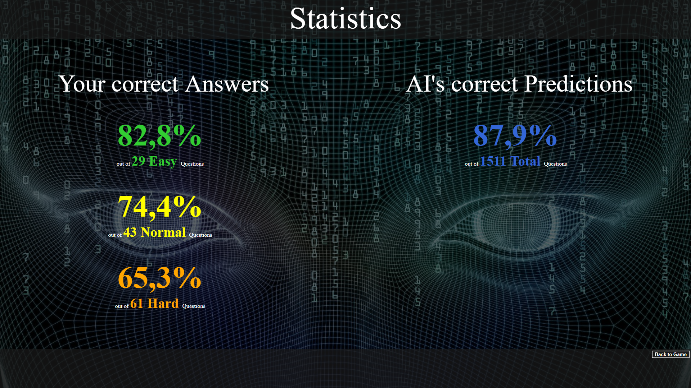
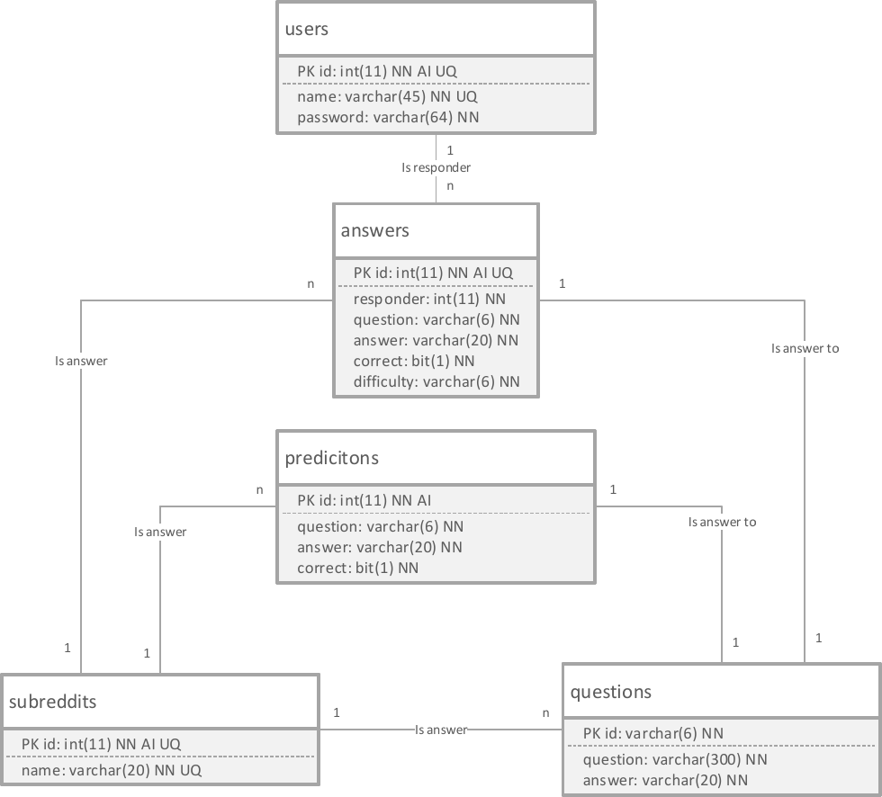

# Reddit Q&A -- Beat the AI

This project provides a Java EE based web application that implements a simple game. The game idea is to compete against the developed AI in a question-answer game. For this purpose, the online platform Reddit is used to determine textual titles of posts in different forums, so that later in the game it has to be decided from which forum the title originally came. In addition to a points system, the user also has the opportunity to compare his success rate with the AI. Using a Recurrent Neural Network, the user is challenged to prove his superiority over the machine.

## Anwendung

Das Spiel beginnt mit einer Frage:

Es gibt einen schweren Modus:

Und einen leichten:

Die KI gibt ihre Antwort ab:

Die Frage wird augelöst:

Der Nutzer kann seine Statistik anschauen:

## Dokumentation

Das Folgende erläutert den Aufbau der Implementierung näher. Durch Maven oder etwaige Frameworks generierte Standarddateien werden hierbei nicht betrachtet.
- java: Dieses Paket enthält die zentralen Quellen der Anwendung.
    - bean: Hier befinden sich die CDI- und EJB beans der Anwendung. Diese serverseitigen Komponenten kapseln die Business-Logik der Anwendung ein.
    - config: Verschiedene Enumeratoren zur Konfiguration der Anwendung.
    - dao: Datenzugriffsobjekte zur Verwaltung des Datenzugriffs der Business-Logik.
    - filters: Enthält den Filter zum Abfangen nicht authentifizierter Nutzer.
    - model: Enthält ORM-Klassen zur Repräsentation und Nutzung der relationalen Datenbank.
    - schedule: Hier befindet sich die Funktionalität zum asynchronen Datenbankupdate-Zyklus und zur Aktivierung der KI.
- resources: Konfigurationsdateien und benötigte Ressourcen.
    - ai: In diesem Verzeichnis befindet sich zum einen der gefrorene Berechnungsgraph unserer KI sowie dessen zugehörige TensorFlow-Session und die Wörterbuchdatei, welche zur Transformation von Texten zu einem KI-kompatiblen Eingabeformat genutzt wird.
    - mls: Hier befinden sich Übersetzungen der Texte des Frontends, welche jedoch nicht gepflegt wurden.
- web: Dieses Paket enthält die Quellen der Webanwendung.
    - game: Hier befinden sich die Dateien des zentralen JSF-Flow, der den Ablauf des Spiels regelt.
    - pages: Dieses Verzeichnis enthält alle Login-geschützten Seiten, die in keine anderen Bereich fallen.
    - register: Hier befinden sich die Dateien des JSF-Flow der Registrierung.
    - resources: In diesem Verzeichnis sich die statischen Inhalte der Webseite (Stylesheets und Bilder).
    - templates: Dieser Bereich ist für JSF-Templates vorhergesehen. Hier befindet sich das Basis-Layout der Webseite, auf dem alle anderen Seiten aufbauen.

## Anwendungsebene

Unsere Anwendungsebene besteht aus der Verwaltung des Spielflusses und der dafür benötigten Subprozesse. Dabei besteht die grundlegende Spielidee darin, dass der Nutzer die von der Gruppe entwickelte künstliche Intelligenz (KI) in einem Frage-Antwort-Spiel schlagen muss. So wird die Onlineplattform Reddit genutzt, um textuelle Titel von Beiträgen in unterschiedlichen Foren (“Subreddits”) zu ermitteln, sodass später im Spiel entschieden werden muss, aus welchem Subreddit der Titel ursprünglich kam. Um dem Nutzer ein ebenso faires wie aufregendes Spielerlebnis zu bieten, erhält die KI lediglich exakt die gleichen Informationen wie der Nutzer: Ausschließlich den Titel des Forum-Beitrags. Da es sich bei der KI um ein selbstlernendes System ([AC-BLSTM Neural Network](https://arxiv.org/abs/1611.01884)) handelt, werden außerdem ausschließlich Fragen genutzt, welche die KI während des Trainings noch nicht gesehen hat, wobei mit etwa 107 Datensätzen eigenständig trainiert wurde. So nutzt die Anwendung einen asynchronen Datenbankupdate-Zyklus, durch den in einem konfigurierten Zeitintervall neue Fragen von der Webseite www.reddit.com ermittelt werden. Hierdurch hat der Nutzer zusätzlich die Möglichkeit die relatierten Forums-Beiträge seiner Fragen in Echtzeit mit der Webseite abzugleichen. Der Update-Zyklus wird so durch eine singleton startup bean mittels eines ScheduledExecutorService” zum Start des Webservers initialisiert. Folgende Schritte werden regelmäßig durchlaufen:

1. Update der verfügbaren Foren auf die unsere KI trainiert wurde. Diese Foren werden genutzt um neue Inhalte von der Webseite Reddits laden zu können.
2. Anhand der JSON-API Reddits werden neue Inhalte abgefragt. Das JSON-Antwortobjekt wird anschließend zergliedert und die für die Fragen des Spiels benötigten Bestandteile werden in der Datenbank gespeichert.
3. Zuletzt wird der gefrorene Berechnungsgraph der KI aktiviert, um die zuvor ermittelten Fragen zu beantworten. Dafür nutzt die Anwendung die TensorFlow Java API.

Durch eine flow scoped “GameBean” wird dann der JSF Flow verwaltet, durch den der Nutzer Fragen erhält, die er zuvor noch nicht beantwortet hat. Hierbei kann er zwischen drei Schwierigkeitsgraden wählen, durch die neben der richtigen Antwort zusätzlich unterschiedlich viele (standardmäßig 4/10/27 für leicht/mittel/schwer) falsche Antwortmöglichkeiten dargestellt werden. Wählt der Nutzer so eine Antwort aus, schreitet der Flow zur vorherig ermittelten Antwort unserer KI voran. Zuletzt wird die richtige Antwort verkündet, wobei jeder der richtig geantwortet hat, einen Punkt erhält. Zusätzlich erhält der Nutzer die Möglichkeit, zum dem ursprünglichen Forumsbeitrag auf Reddit per Link zu navigieren. Diese Schleife aus Frage - Antwort - Lösung kann der Benutzer beliebig oft wiederholen, bis er alle vorhandenen Fragen gelöst hat. Abschließend besteht die Möglichkeit, seine
Statistiken zur Erfolgsquote richtig beantworteter Fragen mit der KI zu vergleichen.

## Persistenzebene

Folgende Abbildung modelliert die Persistenzschicht unserer Anwendung (JPA). Die Längen-Limitierungen der Datentypen, wie beispielsweise “subreddits - name: varchar(20)” order “questions - id: varchar(6)” sind hierbei teilweise von der Webseite Reddit vorgegeben.

- subreddits: “Foren” der Webseite Reddit anhand derer Fragen ermittelt werden.
- questions: Ermittelte Fragen, wobei “question” der Titel des Forenbeitrags mit maximaler Länge 300 ist.
- predictions: Antworten unserer KI auf alle bisherigen Fragen.
- answers: Durch Nutzer gegebene Antworten auf eine Untermenge aller Fragen.
- users: Nutzer-Accounts, die zur Verwendung der Anwendung nötig sind.

## Präsentationsebene

Die Präsentationsebene wurde mittels JavaServer Faces (JSF) implementiert.

## Betriebsdokumentation und Konfiguration

An dem Wildfly Application Server wurden keine Konfigurationen unternommen, die zur Vorlesung abweichen. Entsprechend sind die benötigten MySQL-Connector-Module erforderlich. 
In der Entwicklung wurde ein Datenbanknutzer mit Namen “root” und Passwort “toor” angelegt, wobei auf die jeweiligen Lese- und Schreibberechtigungen zu achten ist. Dieser Nutzer ist jedoch in der persistence.xml Datei auswechselbar.
Zusätzlich ist darauf zu achten, dass der JDBC-Treiber mit den Eigenschaften useLegacy-DatetimeCode=false&serverTimezone=UTC konfiguriert wird, um eine InvalidConnectionAttributeException zu vermeiden.
Vor der Inbetriebnahme der Anwendung muss die Datenbankstruktur manuell angelegt werden. Hierfür steht die SQL-Datei db-setup.sql bereit, die einfach ausgeführt werden muss. Die Zeit bis zur Verfügung der Webanwendung kann von der üblichen Dauer abweichen, da zuvor die singleton startup “QuestionFetchingBean” ihren Dienst verrichtet.

